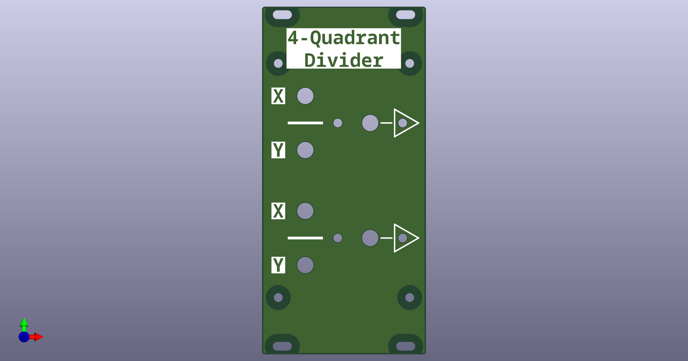
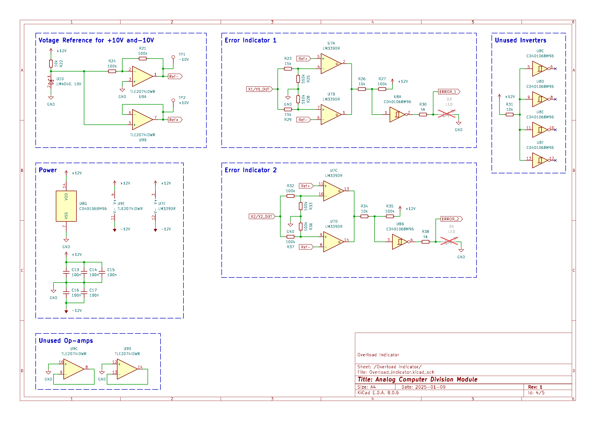

# Analog Computer - 4-Quadrant Division Module
---

This repository provides a 4-Quadrant Division Module for analog computing applications. The design incorporates two independent 4-Quadrant Division circuits, each equipped with an output signal indicator and overload indicator to monitor operation. \
 The overload indicator activates if the output exceeds the machine unit of $\pm10V$ and the output signal indicator is red or green proportional to the negative or positive output voltage. This display enables easy diagnostic of an analog computing patch.

## Module Schematic

The schematic is divided into multiple sections for the ease of understanding. All functional modules like power management, division and error-indication have their own page in the circuit diagram.

<ins> 4-Quadrant Divider: </ins>\
The division is accomplished by having the multiplier in the feedback path of an operational amplifier, thus solving for $-X/|Y|$. To cover all 4 Quadrants of the input, we first have a section to get the absolute Value of of $Y$, which is fed into the division. The output then corrects for the sign of the input $Y$ and inverts the signal when needed. Thus the Output is $X/Y$, covering all 4 Quadrants of the input. To enable easy diagnostic and debugging of an analog patch, the LED indicator displays the polarity and size of the output signal.

<ins> Overload Indicator: </ins>\
The output signal of each seperate division circuit is compared to a reference voltage of $+10V$ and $-10V$. A red LED indicates the value of a division is exceeding the machine value of $\pm10V$. Which can easiliy happen when the absolute value of $Y$ gets small.

The Error Indicator for each individual Output takes a lot of extra space and components, but I consider it worth it for error hunting in an analog patch.

<ins> Sources: </ins>\
The circuit is mostly based on the [THAT](https://the-analog-thing.org/) of [Anabrid GmbH](https://anabrid.com/), which has its circuit diagram openly available at their github repository [Anabrid](https://github.com/anabrid/the-analog-thing/tree/main). Also a special mention goes to Michael Koch who has put together a large collection of analog computing circuits in his [book on the THAT Analog Computer](http://www.astro-electronic.de/THAT_Analog_Computer_Book.pdf).

## List of special Components:

- OP-amp: [TLE2074IDWR](https://www.digikey.de/en/products/detail/texas-instruments/TLE2074IDWR/2799317) (Upgrade of the [TL074HIDR](https://www.digikey.de/en/products/detail/texas-instruments/TL074HIDR/13563033))
- analog IC switch: [DG456EY](https://www.digikey.de/en/products/detail/vishay-siliconix/DG456EY-T1-E3/1850020), [DG419BDY-E3](https://www.digikey.de/en/products/detail/vishay-siliconix/DG419BDY-E3/2621756), [DG403DYZ](https://www.digikey.de/en/products/detail/renesas-electronics-corporation/DG403DYZ/936160)
- 10V voltage reference: [LM4040CIM3-10.0/NOPB](https://www.digikey.de/en/products/detail/texas-instruments/LM4040CIM3-10-0-NOPB/363991)
- comparator: [LM339DR](https://www.digikey.de/en/products/detail/texas-instruments/LM339DR/276657)
- logic inverter: [CD40106BM96](https://www.digikey.de/en/products/detail/texas-instruments/CD40106BM96/525858)

Altnernatives to consider:
- Multiplier: [AD633JRZ](https://www.digikey.de/en/products/detail/analog-devices-inc/AD633JRZ/617831) to [AD835ARZ](https://www.digikey.de/en/products/detail/analog-devices-inc/AD835ARZ-REEL7/621103)

## License

This work is published under the [CERN Open Hardware Licence Version 2 - Strongly Reciprocal](LICENSE)
