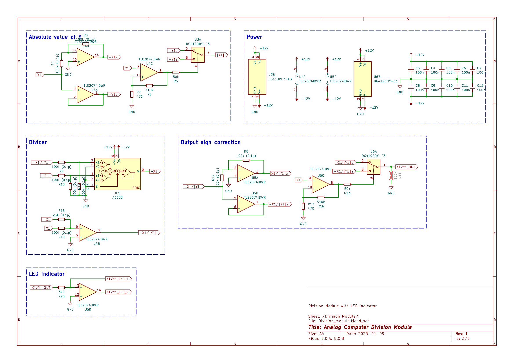

# Analog Computer - 4-Quadrant Division Module
---

This repository provides a 4-Quadrant Division Module for analog computing applications. The design incorporates two independent 4-Quadrant Division circuits, each equipped with an output signal indicator and overload indicator to monitor operation. \
 The overload indicator activates if the output exceeds the machine unit of $\pm10V$ and the output signal indicator is red or green proportional to the negative or positive output voltage. This display enables easy diagnostic of an analog computing patch.

## Module Schematic

The schematic is divided into multiple sections for the ease of understanding. All functional modules like power management, division and error-indication have their own page in the circuit diagram.

<ins> 4-Quadrant Divider: </ins>\
The division is accomplished by having the multiplier in the feedback path of an operational amplifier, thus solving for $-X/|Y|$. To cover all 4 Quadrants of the input, we first have a section to get the absolute Value of of $Y$, which is fed into the division. The output then corrects for the sign of the input $Y$ and inverts the signal when needed. Thus the Output is $X/Y$, covering all 4 Quadrants of the input. To enable easy diagnostic and debugging of an analog patch, the LED indicator displays the polarity and size of the output signal.

<ins> Overload Indicator: </ins>\
The output signal of each seperate division circuit is compared to a reference voltage of $+10V$ and $-10V$. A red LED indicates the value of a division is exceeding the machine value of $\pm10V$. Which can easiliy happen when the absolute value of $Y$ gets small.

The Error Indicator for each individual Output takes a lot of extra space and components, but I consider it worth it for error hunting in an analog patch.

<ins> References: </ins>\
The circuit is mostly based on the [THAT](https://the-analog-thing.org/) of [Anabrid GmbH](https://anabrid.com/), which has its circuit diagram openly available at their github repository [Anabrid](https://github.com/anabrid/the-analog-thing/tree/main). Also a special mention goes to Michael Koch who has put together a large collection of analog computing circuits in his [book on the THAT Analog Computer](http://www.astro-electronic.de/THAT_Analog_Computer_Book.pdf).

## BOM

**<ins>Main Module:</ins>** 

|Reference                                                   |Value              |Footprint                      |QUANTITY|
|------------------------------------------------------------|-------------------|-------------------------------|--------|
|C1,C2                                                       |10u                |1206 / 3216Metric              |2       |
|C3-C27                                                      |100n               |1206 / 3216Metric              |25      |
|D1                                                          |12V_GREEN          |1206 / 3216Metric              |1       |
|D2                                                          |-12V_RED           |1206 / 3216Metric              |1       |
|IC1,IC2                                                     |AD633              |SOIC-8                         |2       |
|J1                                                          |Conn_01x14_Pin     |PinHeader_1x14_P2.54mm_Vertical|1       |
|J2                                                          |Conn_02x05_Odd_Even|PinHeader_2x05_P2.54mm_Vertical|1       |
|Q1                                                          |PMV250EPEA         |SOT-23                         |1       |
|Q2                                                          |PMV450ENEA         |SOT-23                         |1       |
|R1,R2                                                       |5k6                |1206 / 3216Metric              |2       |
|R3,R4,R8-R10,R12,R14,R15,R19,R39,R40,R44-R46,R48,R50,R51,R55|100k (0.1p)        |1206 / 3216Metric              |18      |
|R5,R13,R41,R49                                              |50k                |1206 / 3216Metric              |4       |
|R6,R16,R25,R28,R42,R52                                      |510k               |1206 / 3216Metric              |6       |
|R7,R17,R43,R53                                              |470                |1206 / 3216Metric              |4       |
|R18,R54                                                     |25k (0.1p)         |1206 / 3216Metric              |2       |
|R20,R56                                                     |3k9                |1206 / 3216Metric              |2       |
|R21,R24,R27,R32,R33,R35-R37                                 |100k               |1206 / 3216Metric              |8       |
|R22,R26,R31,R34                                             |10k                |1206 / 3216Metric              |4       |
|R23,R29                                                     |15k                |1206 / 3216Metric              |2       |
|R30,R38                                                     |4k                 |1206 / 3216Metric              |2       |
|U1,U2                                                       |VCAN16A2           |SOT23-3                        |2       |
|U3,U6,U11,U14                                               |DG419BDY-E3        |SOIC-8                         |4       |
|U4,U5,U9,U12,U13                                            |TLE2074IDWR        |SOIC-14                        |5       |
|U7                                                          |LM339DR            |SOIC-14                        |1       |
|U8                                                          |CD40106BM96        |SOIC-14                        |1       |
|U10                                                         |LM4040, 10V        |SOT-23                         |1       |

**<ins>Middleplate:</ins>**

|Reference                                                   |Value              |Footprint                      |QUANTITY|
|------------------------------------------------------------|-------------------|-------------------------------|--------|
|D1                                                          |IND_X1/Y1          |LED_D3.0mm_FlatTop             |1       |
|D2                                                          |ERROR_1            |LED_D3.0mm_FlatTop             |1       |
|D3                                                          |IND_X2/Y2          |LED_D3.0mm_FlatTop             |1       |
|D4                                                          |ERROR_2            |LED_D3.0mm_FlatTop             |1       |
|J1                                                          |Conn_01x14_Socket  |PinSocket_1x14_P2.54mm_Vertical|1       |
|U1-U3                                                       |VCAN16A2-03S-E3-08 |SOT23-3                        |3       |

## List of special Components:

- OP-amp: [TLE2074IDWR](https://www.digikey.de/en/products/detail/texas-instruments/TLE2074IDWR/2799317) (Upgrade of the [TL074HIDR](https://www.digikey.de/en/products/detail/texas-instruments/TL074HIDR/13563033))
- analog IC switch: [DG456EY](https://www.digikey.de/en/products/detail/vishay-siliconix/DG456EY-T1-E3/1850020), [DG419BDY-E3](https://www.digikey.de/en/products/detail/vishay-siliconix/DG419BDY-E3/2621756), [DG403DYZ](https://www.digikey.de/en/products/detail/renesas-electronics-corporation/DG403DYZ/936160)
- 10V voltage reference: [LM4040CIM3-10.0/NOPB](https://www.digikey.de/en/products/detail/texas-instruments/LM4040CIM3-10-0-NOPB/363991)
- comparator: [LM339DR](https://www.digikey.de/en/products/detail/texas-instruments/LM339DR/276657)
- logic inverter: [CD40106BM96](https://www.digikey.de/en/products/detail/texas-instruments/CD40106BM96/525858)

Altnernatives to consider:
- Multiplier: [AD633JRZ](https://www.digikey.de/en/products/detail/analog-devices-inc/AD633JRZ/617831) to [AD835ARZ](https://www.digikey.de/en/products/detail/analog-devices-inc/AD835ARZ-REEL7/621103)

## License

This work is published under the [CERN Open Hardware Licence Version 2 - Strongly Reciprocal](LICENSE)
